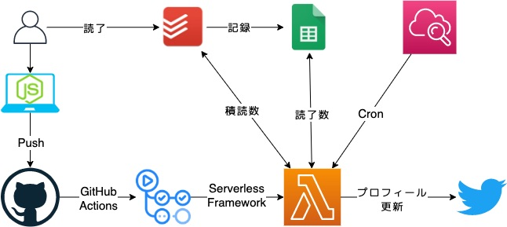

## はじめに

Twitterプロフィールに消化度合いを表示させると緊張感が出て捗るのでは？と思ったのでやってみた時のおぼえがき。
おまけでAWS Lambdaへ自動デプロイするCI/CDチックな仕込みもやってみた。

本エントリで出てくるコードはGitHubで管理している。

[github.com](https://github.com/csnagu/pile-up-twitter)

GASはgist。

[https://gist.github.com/csnagu/3f0e7f2a7fcf5ace1262f4c0f78e0212](https://gist.github.com/csnagu/3f0e7f2a7fcf5ace1262f4c0f78e0212)

## 動機

ふと買ったけど読んでいない本（積読）が一体どれだけあるのか気になりTodoistへ書き出してみた。

今読む読まないは別として、参考書だけで70冊ほどありこれはなんとかせねばと思いつつ、何もせずに2ヶ月経過したのでなにかしらの手を打つことにした。
3秒くらい考えて「誰にも見られないから緊張感がないのでは？」と考えついたので積読消化の進捗を公開することに。
公開するからにはよく目にする場所のほうが緊張感が高まって良さそうだと思い日頃開いているTwitterを使うことにした。

この記事を読んで「こんなもの作ってる暇あったら1冊読め」と思った人。
僕も同じこと思いました。

## 構成

### 関連サービス

- GitHub ... コードのバージョン管理
- Twitterのプロフィールを更新
- CloudWatch ... Lambdaを定期実行
- Todoist ... 積読を管理
- GoogleSpreadsheet ... 読み終わった書籍を管理
- Google App Script ... Todoistで完了したタスクをGoogleSpreadsheetに記録する
- IFTTT ... みんなの架け橋
- Twitter ... 緊張感を届ける

盛りだくさん！

### 構成図

TodoistとGoogleSpreadsheetの間にGoogle Apps Script（GAS）やIFTTTが抜けているんだけど図の修正が面倒なので割愛。

## 仕組み

### 積読と読了の管理・取得 - Todosit, GoogleSpreadsheetの使い分け

積読リストは適当なプロジェクトに分けておく（Project IDを後で使う）。
積読リストと読了リストの管理が別のアプリでややこしいが、Todoistの無料プランでは一日に完了にしたタスクを取得できないようなので割り切った。TodoistとGoogleSpreadsheetはGASを書いてIFTTTで連携させておく。

- 非常に参考にしたサイト 
  - [Todoist（無料プラン）で完了したタスクを日報に記録する方法。IFTTT+GoogleAppsScript(GAS)+Googleドキュメント | internetthingy](https://internetthingy.com/todoist-ifttt-gas-63.html)
- GoogleSpreadsheetに対応させたコード 
  - [https://gist.github.com/csnagu/3f0e7f2a7fcf5ace1262f4c0f78e0212](https://gist.github.com/csnagu/3f0e7f2a7fcf5ace1262f4c0f78e0212)
- GoogleSpreadsheetの行数を取得するコード 
  - [https://github.com/csnagu/pile-up-twitter/blob/master/getReadBooksNum.js](https://github.com/csnagu/pile-up-twitter/blob/master/getReadBooksNum.js)

一度積読をTodoistでリスト化してしまえば、読み終わったものを完了にすることであとは自動で回ってくれる。
賢い。

### OAuth認証とTwitterAPIとの戦い

公式リファレンスを読めば全部解決！
Twitter公式リファレンス - Authentication: [https://developer.twitter.com/en/docs/basics/authentication/overview](https://developer.twitter.com/en/docs/basics/authentication/overview)

するほどの理解力がなかったので適当にググる。
npm oauth1.0a などのキーワードでググるとちょうど良さそうなのがあった。
ゆくゆくはAWS Lambdaに乗せて走らせようとここらへんで思い立ったので、言語はnode.jsで書くことにした。

[www.npmjs.com](https://www.npmjs.com/package/oauth-1.0a)

あとは通信だが、昔使った[axios](https://github.com/axios/axios)を今回も使う。

- TwitterAPIを叩いてプロフィールを更新するコード 
  - [https://github.com/csnagu/pile-up-twitter/blob/master/updateTwitterProfile.js](https://github.com/csnagu/pile-up-twitter/blob/master/updateTwitterProfile.js)

### Lambdaで定期実行する - AWS LambdaとCloudWatch

試行錯誤の末、ローカルでクラウド環境で走らせる。
日に1回実行できればいいくらい、かつ、ローカルにファイルが必要ないため今回はLmbdaを選択した。
書いたコードがそのまま動くはずなので、あまり考えずにexports.handlerの中に処理を押し込めて、zipで圧縮してLambdaへアップロードした。
これは利用しているパッケージがLambda上で利用できないため、node_modulesも含めてzipで圧縮してアップロードする必要があるため。

Lambda上で動くのを確認したら、LambdaのDesigner欄から「トリガーを追加」を選択し、CloudWatch Events/EventBridgeにて1日1実行のルールを作成する。

- Lambdaの定期実行で参考にしたサイト 
  - [【AWS】lambdaファンクションを定期的に実行する - Qiita](https://qiita.com/Toshinori_Hayashi/items/5b0a72dc64ced91717c0)

素晴らしい、一日一回自動で実行される様になったのだ。
（プログラムは自動で走るが本は自動で読まれたりはしない。）

### 環境変数に敗北

せっかく一部AWS Lambdaに自動でデプロイできれば10割増しでクールに見えるだろう。
ここは非常にハマったので参考資料を適宜参照しよう。

- 参考 
  - [https://developer.twitter.com/en/docs/basics/authentication/overview](https://developer.twitter.com/en/docs/basics/authentication/overview)
  - [GitHub Actionsを使ってAWS Lambdaへ自動デプロイ (詳説＋デモ手順付きver) - Qiita](https://qiita.com/homines22/items/412d4e81b24804d75205)
  - [Serverless FrameworkでAWS Lambdaをデプロイ - Qiita](https://qiita.com/t_okkan/items/6843afba84d684068341)
  - [Serverless Framework Documentation](https://serverless.com/framework/docs/)
  - [今から始めるServerless Frameworkで簡単Lambda開発環境の構築 | Developers.IO](https://dev.classmethod.jp/articles/easy-deploy-of-lambda-with-serverless-framework/)

ここのハマリポイントとしては、Lambda側の環境変数にどうやって値をセットするかという部分だ。
serverless.ymlにenvironmentとして値を設定することでLmbda側のGitHubにアップロードするわけにはいかない。
GitHub Actionsのジョブを定義しているymlファイルからのみのようで実現できなかった。うまいやり方が無いものか。。。
（そもそも秘密情報を環境変数で扱うのは間違っているような気がしていて、別の手がありそう。）

## 感想

async, await周りの理解が拙くて、1 / 70 のような表記にしたかったのに NaN / undefined となってしまった。
また、Twitterで触れたOAuthやTodoistで触れたBearerToken周りの理解が足りていなくて問題の切り分けがやりづらく感じたので上辺だけでも理解したいなと。
実装面やデプロイ面に関してはベストプラクティスのようなものがわからないまま突き進んでしまったので、このブログエントリを読んだ詳しい人教えて下さい。

何はともあれAWS Lambdaへの自動デプロイができたので、今後似たようなことをやるときには割とすんなりできるようになっていると思う。

Twitterで確認できるようになったので（しかも自動更新！）、これで少しは捗るといいな。
